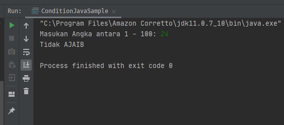

# If Else Condition

##### Introduction to programming
##### SESSION 5 - Selection (OL) #3

```java
package binus.ol.ac.id;

import java.util.Scanner;

public class ConditionJavaSample {
    public static void main(String[] args) {

        // make input variable for user input
        Scanner input = new Scanner(System.in);

        // Create a while loop condition
        // If any error happens or condition is not met, than repeat
        while (true) {

            // Ask user to make an number as input between 1 - 100
            System.out.print("Masukan Angka antara 1 - 100: ");

            // Try and Catch to check whether user input is numeric
            try {
                int n = input.nextInt(); // save user input to variable 'n'

                if (n >= 1 && n <= 100) { // only number between 1 - 100 is proceed to next case

                    if (n % 2 != 0) { // jika - ganjil, cetak "AJAIB"
                        System.out.println("AJAIB");
                    } else { // angka bilangan genap

                        if (n <= 5) { // Jika n genap dan masih dalam rentang 2 - 5, cetak "Tidak AJAIB"
                            System.out.println("Tidak AJAIB");
                        } else if (n <= 20) { // Jika n genap dan masih dalam rentang 6 - 20, cetak "AJAIB"
                            System.out.println("AJAIB");
                        } else { // Jika n genap dan lebih besar dari 20, cetak "Tidak AJAIB"
                            System.out.println("Tidak AJAIB");
                        }
                    }

                    break; // exit loop as condition is met.
                }

                System.out.println("Kesalahan pada input, silahkan coba lagi: "); // tell user to try again

            } catch (Exception e) {
                // tell user to try again
                System.out.println("Kesalahan pada input, silahkan coba lagi: ");
                input = new Scanner(System.in);
            }
        }
    }
}

```
*Sample-1*  


*Sample-2*  
